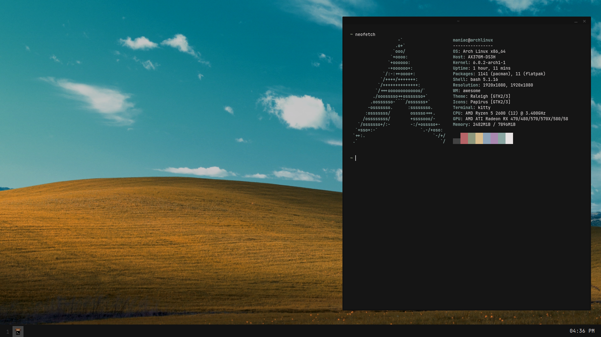

<h1 align="center">Dotfiles</h1>
<h4 align="center">Config files for AwesomeWM</h4>

<p align="center">
  
</p>

## Installation

- Clone the repo

  ```
  git clone https://github.com/Maniac/dotfiles.git --depth=1 --branch='main' && cd dotfiles
  ```

- Install all the dependencies (PACMAN)

  ```
  ./install-dep.sh 
  ```

- Install / Copy all configs

  ```
  ./install.sh 
  ```

</details>

## Usage [ Keybinds ] 
| Key                                  | Action                     |
| -----                                | -----                      |
| **[Software]**                       | **Action**                 |
| Print                                | flameshot gui              |
| Super + r                            | rofi                       |
| Super + Return                       | kitty                      |
|                                      |                            |
| **[Hardware]**                       | **Action**                 |
| Fn + Arrow [Up,Down]                 | Volume Control             |
| Fn + Arrow [Left,Right]              | Brightness Control         |
|                                      |                            |
| **[AwesomeWM]**                      | **Action**                 |
| Super + q                            | kill focused window        |
| Alt + Tab                            | toggle window focus        |
| Super + Tab                          | toggle floating/tiling     |
| Super + space                        | toggle fullscreen          |
| Super + [1-9]                        | focus desktop 1-9          |
| Super + Shift + [1-9]                | move window to desktop 1-9 |
| Super + Arrow [Up,Down,Left,Right]   | resize window              |

## Special Thanks

  - [Manas140](https://github.com/Manas140/dotfiles)